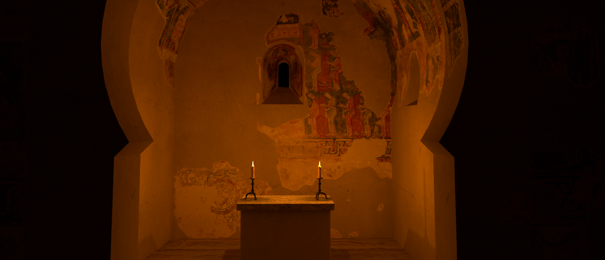
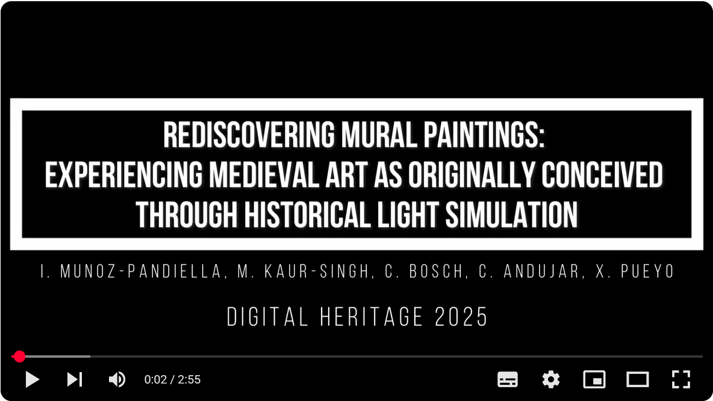

# Mural Lighting

This is the official repository of:

*Rediscovering Mural Paintings: Experiencing Medieval Art as Originally Conceived Through Historical Light Simulation*. Munoz-Pandiella, I.; Kaur-Singh, M.; Bosch, C.; Andujar, C.; Pueyo, X. Digital Heritage 2025 



## Overview
Here you can find a video that overviews our work:

[](https://www.youtube.com/watch?v=AUqzzYyuAXw)

## Repository Organization

The repository is organized into the following main folders:

```text
repo-root/
│
├── doc/  
│   ├── paper/           # Research paper (PDF, supplementary material, etc.)  
│   └── slides/          # Presentation slides  
│
├── webapp/  
│   └── ...              # Code of the web application to visualize rendered hypotheses  
│
├── simulation/  
│   └── ...              # Code and data needed to run the simulations  
│
└── README.md            # This file
```

## Acknowledgements
This work has been partially supported by the projects
PID2021-122136OB-C21 and PID2021-122136OB-C22 funded
by MCIN/AEI/ 10.13039/501100011033 and by FEDER A
way of making Europe, and by the Department of Research
and Universities of the Generalitat de Catalunya (2021 SGR
01035).